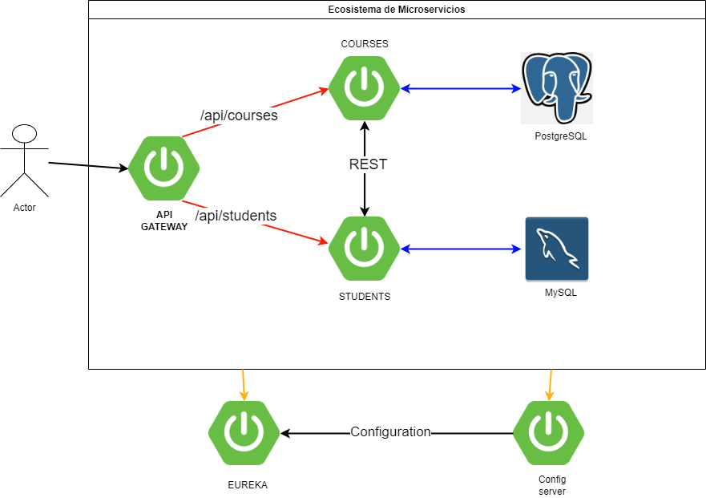

# Título

### Proyecto MicroServicios con SpringBoot

# Autor

### Deivid Medina

## Descripción del Proyecto

El Proyecto MicroServicios es una iniciativa que busca fortalezar el conocimeinto
sobre microservicios con SprintBoot, añadiendo un poco de dificultad al considerar un 
api gateway como eureka y configServer. 

Este proyecto se enfoca en 5 microservicios utilizando tecnologias
como lo son java, SpringBooot, PostgreSQL y Mysql.

La meta es ver paso a paso la comunicación que se puede lograr con el fin de poner a prueba
la arquitectura de microservicios y poner en caliente una prueba con postman.

La arquitectura que se va a llevar a cabo es la siguiente como se muestra en la imagen.

## Dificultades
Durante el desarrollo de este proyecto, nos enfrentamos a varias dificultades que desafían nuestras habilidades y creatividad. Algunas de las principales dificultades incluyen:

- Dependencias: Al momento de generar las dependencias con SpringBoot Initializr, algunas dependencias no funcionanban por x o y motivo por lo cual toco documentarse en distintos foros.

Estas dificultades han sido oportunidades para aprender y mejorar nuestras habilidades técnicas y de gestión de proyectos.

## Atribuciones
Agradecemos y damos créditos a las siguientes personas y proyectos que contribuyeron de manera directa o indirecta al desarrollo de este proyecto:

-  [Un Programador Nace](https://www.youtube.com/@unprogramadornace) - Canal de Youtube
--- 

¡Gracias por tu interés en nuestro proyecto! Si tienes preguntas o sugerencias, no dudes en
ponerte en contacto con nosotros. 

¡Esperamos que encuentres valor en el Proyecto!
